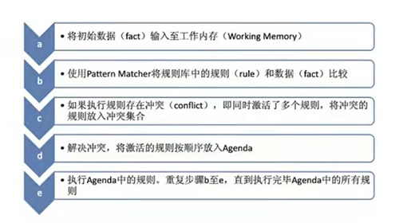

# drools-achieve

> [Drools Learning.](https://docs.drools.org/7.64.0.Final/drools-docs/html_single/index.html)

## 1 Concept

|No.|Name| Remark   |
|:---:|:---:|----------|
|1|Working Memory|*工作内存*|
|2|Fact|*事实，即普通JavaBean写到Working Memory后的对象*|
|3|Rule Base|*规则库*|
|4|Pattern Matcher|*匹配器*|
|5|Agenda|*议程*|
|6|Execution Engine|*执行引擎*|

## 2 Workflow

## 3 Syntax

### 3.1 Condition

- contains
- not contains
- matches
- not matches
- memberOf
- not memberOf

### 3.2 Result

- insert
- update
- retract

### 3.3 Props

- salience (default 0)
- no-loop (default false)
- date-effective
- date-expires
- enabled (default true)
- dialect
- activation-group
- agenda-group
- auto-focus (default false)
- timer

### 3.4 Advanced

- package
- import
- global
- query
- function
- rule end
